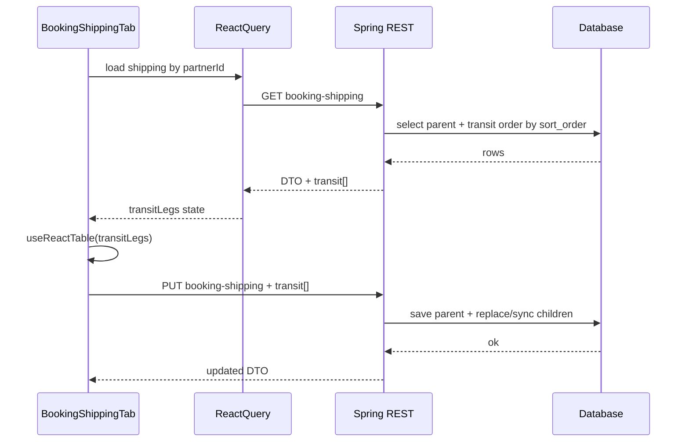

# Booking Fields Specification — Shipping (Booking Management)

This document defines the **Shipping** subsection under **Booking Management** (admin dashboard: section below Partner). It is for **review and sign-off** before backend/UI implementation.

---

## Scope and placement

| Item | Detail |
|---|---|
| UI location | Admin → Booking Management → **Shipping** tab (`BookingShippingTab`) |
| Current code state | Shell only: card + placeholder text; **no shipping form fields or persistence yet** |
| Related master data | **`ports`** table and Port API/DTO are **already available** for port pickers (see below) |

---

## Implementation status (repository snapshot)

Use this column when implementing; update the doc when status changes.

| Area | Status | Notes |
|---|---|---|
| Shipping tab UI | **Placeholder** | `BookingShippingTab.tsx` — no fields wired |
| Port master data | **Ready** | Entity `Port` / `PortDTO`: `id`, `name`, `portOfCall`, `provinceId`, `countryCode`, `code`, `zoneCode`, coordinates, `isActive`, … API consumed via `portService` (frontend) |
| Booking partner (customer) | **Separate feature** | `BookingPartner` covers partner list/detail (name, customer id, address, contacts, etc.) — **not** the shipping leg fields in this spec |
| Shipping fields persistence | **Not started** | No dedicated booking-shipping entity/API in this spec’s sense yet |

---

## Implementation roadmap (phased — track progress)

Use this section as the **single checklist** for delivery. Update the **Status** column (`Not started` → `In progress` → `Done`) and **Notes** as work proceeds. Phase order follows the **end-to-end** track in **TanStack Table & end-to-end implementation** (database → backend → frontend infrastructure → integrated UI → hardening).

### Phase overview

| Phase | Name | Goal | Depends on |
|:---:|:---|:---|:---|
| **0** | Prerequisites & domain | Open points resolved; parent record keyed correctly | — |
| **1** | Data layer | Migrations **`booking_shipping`** + **`booking_transit_port`** per TanStack **§1** (FKs, indexes) | Phase 0 |
| **2** | Backend API & persistence | JPA parent/child, GET + PUT with **`transitLegs`**, validation, security (TanStack **§2**) | Phase 1 |
| **3** | Frontend infrastructure | Types, API client, React Query, **`formatPortLabel`**, port combobox / cache | Phase 2 (contract stable enough) |
| **4** | End-to-end UI (`BookingShippingTab`) | Form §1–§5, §7 **and** §6 TanStack grid; GET hydrate + **one Save** PUT parent + transit (TanStack **§3–§4**) | Phase 3 |
| **5** | Hardening & documentation | Validation, inactive port behaviour, **Implementation status**, smoke test | Phase 4 |

### Phase 0 — Prerequisites & domain

| # | Task | Status | Notes |
|---:|---|:---:|---|
| 0.1 | Resolve **Open points** (cargo name, missing `ports.code`, inactive ports, `name` vs `port_of_call`) | Not started | Record decisions inline in § Open points or here |
| 0.2 | Define **parent identity**: e.g. one `booking_shipping` row per `booking_partner_id`, or per future `booking_id` | Not started | Drives all FKs and URLs |
| 0.3 | Confirm **Service Mode**, **Volume**, **Freight terms**, **Contact** option sources (static vs DB) | Not started | Affects Phase 2 seeding or admin config |

### Phase 1 — Data layer (database schema)

| # | Task | Status | Notes |
|---:|---|:---:|---|
| 1.1 | Implement parent table **`booking_shipping`** with typed columns per **TanStack §1** (§1–§5, §7 scalars + five port FKs + audit); nullable where spec allows | Not started | Cross-check **§6 — Database persistence** |
| 1.2 | Implement child table **`booking_transit_port`** (`booking_shipping_id`, `sort_order`, `port_id`, `eta`, `etd`) per TanStack **§1** | Not started | Preferred over JSON per spec |
| 1.3 | Add indexes (parent FK, each `*_port_id`, `(booking_shipping_id, sort_order)`) | Not started | |
| 1.4 | Apply migration in dev/staging; verify rollback story | Not started | |

### Phase 2 — Backend API & persistence

| # | Task | Status | Notes |
|---:|---|:---:|---|
| 2.1 | JPA entities + `@OneToMany` transit with `orphanRemoval`, `CascadeType.ALL` as appropriate | Not started | Mirror `Post` → child collection pattern |
| 2.2 | Repositories + service: load/save **`transitLegs`** with **0-based `sort_order`** (replace or diff-by-`id`; null `id` = insert) | Not started | TanStack **§2** |
| 2.3 | Validate every `port_id` (parent + each leg); enforce **active-port** rule per product decision | Not started | |
| 2.4 | **GET** detail: parent + transit sorted by `sort_order`; pick and document **DTO A** (ids only) vs **DTO B** (`portSummary.label`) | Not started | **Port picker rules** |
| 2.5 | **PUT** body: full parent scalars + **`transitLegs: [{ id?, portId, sortOrder, eta, etd }]`** | Not started | Matches TanStack **§4** sequence |
| 2.6 | **Security**: same admin auth as Booking Management; integration tests happy path + 403 | Not started | |

### Phase 3 — Frontend foundations

| # | Task | Status | Notes |
|---:|---|:---:|---|
| 3.1 | TypeScript types matching API (shipping + `transitLeg[]`) | Not started | |
| 3.2 | API client + React Query keys/mutations for shipping resource | Not started | Align with [react-query.config.ts](frontend/src/shared/config/react-query.config.ts) patterns |
| 3.3 | Shared **`formatPortLabel(port)`** implementing `{NAME_UPPER}, {CC} ({CODE})` | Not started | Reuse in picker + readonly display |
| 3.4 | Reusable **port combobox** (or document reuse of existing admin combobox + ports list cache) | Not started | Use existing `portService`; see [useQueryListCache](frontend/src/shared/hooks/useQueryListCache.ts) if applicable |

### Phase 4 — End-to-end UI (`BookingShippingTab`)

**Definition of done:** form §1–§5, §7 **and** §6 transit grid work together; **GET** hydrates parent + `transitLegs`; **single Save** sends **PUT** with parent + `transitLegs`; round-trip verified (TanStack **§3–§4**). You may implement **form first, then table** inside this phase, but the phase is **not** complete until DoD is met.

| # | Task | Status | Notes |
|---:|---|:---:|---|
| 4.1 | Replace placeholder: **§1 General**, **§2 Origin**, **§3 Destination**, **§4 Consignment**, **§5 Contact**, **§7 Terms** — shared components only | Not started | **UI implementation notes** |
| 4.2 | **§6:** `TransitLegRow[]` state; **`useReactTable`** + [`DataTableContent`](frontend/src/shared/components/ui/data-table.tsx); `getCoreRowModel` (no pagination unless needed) | Not started | **TanStack Table & end-to-end implementation** |
| 4.3 | `ColumnDef`s: port combobox (`formatPortLabel`), ETA/ETD, actions; add/remove rows; renumber **0-based `sort_order`** | Not started | |
| 4.4 | **GET** hydrates form + table; **PUT** submits parent + `transitLegs`; React Query invalidate/refetch; loading + errors on form and table | Not started | TanStack **§4** sequence |
| 4.5 | Client validation for **required** fields (Booking No., Place of Receipt, Place of Delivery) | Not started | May follow 4.4 if needed |
| 4.6 | Optional: drag reorder → rewrite `sort_order` | Not started | Defer if not MVP |

### Phase 5 — Hardening & documentation

| # | Task | Status | Notes |
|---:|---|:---:|---|
| 5.1 | Empty / error states; loading skeletons consistent with admin | Not started | |
| 5.2 | Behaviour when **port deactivated** after save (display policy from Open points) | Not started | |
| 5.3 | Update **Implementation status** table at top of this doc; link PRs or tickets in Notes | Not started | |
| 5.4 | Smoke E2E or manual test script (create → edit → reload) | Not started | |
| 5.5 | Optional: paginated **list** of many booking-shipping rows (TanStack + `DataTablePagination`) | Not started | Future; not MVP tab |

---

## Data type conventions

- **string**: standard text input  
- **number**: numeric input  
- **date**: date only (see **UI reuse** — same control as ETA)  
- **datetime**: date and time (calendar **date** portion uses the same picker as ETA; **time** uses an existing admin pattern — e.g. native `datetime-local` or existing time field component if the app already has one)  
- **textarea**: multi-line text  
- **select type**: predefined list (non-port)  
- **port picker**: selection from **`ports`** (see Port display rules)  
- **required**: mandatory field  

---

## UI implementation notes (reuse only — no bespoke controls)

When implementing **Booking Shipping**:

1. **Use existing shared components** (same stack as the rest of admin): e.g. `Input`, `Label`, `Textarea`, `Select` / combobox patterns, **`DatePicker`** from `@/shared/components/ui/date-picker`, etc. **Do not** introduce one-off custom date or port widgets unless a gap is found and agreed.  
2. **Date-only fields** must reuse the **same date picker as ETA** on **Create New EPDA**: `DatePicker` with `id="eta"` pattern in `CreateInvoiceVariantForm.tsx` (used from `CreateInvoiceTab` for HCM/QN invoice forms). Apply that same `DatePicker` to every **date** field in this spec (e.g. Date of Pick up, Date of Creation).  
3. **Datetime fields**: use the **same `DatePicker` for picking the calendar date** as ETA; combine with the project’s existing approach for time (if none exists yet, add time in a minimal way consistent with other admin screens — still no custom calendar).  

---

## Port picker rules (all “place” ports)

Any field that is a **port** (receipt, loading, discharge, delivery, final destination, transit) must:

1. **Source**: row from the **`ports`** table. Persist **`port_id`** (FK → `ports.id`) for every port picker below and for each §6 transit row; see **§6 — Database persistence**.  
2. **Display in the picker and when a port is selected** — single-line label (display-only transforms; DB keeps canonical values):  

   **`{PORT_NAME_UPPER}, {COUNTRY_CODE} ({PORT_CODE})`**

   - **`PORT_NAME_UPPER`**: port display name in **UPPERCASE** — use the same field the product treats as the primary port label (typically `ports.name`; align with Manage Ports / port table if both `name` and `port_of_call` exist).  
   - **`COUNTRY_CODE`**: from `ports.country_code` (e.g. `VN`).  
   - **`PORT_CODE`**: from `ports.code` (e.g. UN/LOCODE-style such as `VNIUH` for Qui Nhon).  

   **Example (sign-off sample):** `QUI NHON PORT, VN (VNIUH)`  

   If `code` is empty, omit the parenthetical or show `, VN` only — **confirm** with product.  
3. **Filtering**: only **active** ports (`is_active`) unless product decides otherwise.

Fields using **port picker** (replace generic “select type” for these):

- Place of Receipt  
- Port of Loading  
- Port of Discharge  
- Place of Delivery  
- Final destination  
- Transit Port (each row in the transit list)  

---

## 1) General

| Field | Data Type | Note |
|---|---|---|
| Booking No. | string | required, usually a booking code, may be readonly |
| Booking To | string | text input |
| Booking Number Reference | string | text input |
| Booking Note | textarea | multi-line note |
| Service Mode | select type | select service mode |

---

## 2) Origin

| Field | Data Type | Note |
|---|---|---|
| Place of Receipt | port picker | required |
| Port of Loading | port picker | loading port |
| Pick up | string | text input |
| ETD | datetime | estimated time of departure; date via same `DatePicker` as EPDA ETA |
| Date of Pick up | date | pickup date; **`DatePicker`** same as EPDA ETA |
| Drop off/Warehouse | string | text input |
| Feeder Vessel | string | feeder vessel name |
| Feeder Voyage | string | feeder voyage code |
| Mother Vessel | string | mother vessel name |
| Mother Voyage | string | mother voyage code |
| Provider | string | text input |
| Carrier | string | text input |
| CY Cut-off | datetime | CY cut-off; date picker same as EPDA ETA |
| SI Cut-off | datetime | SI cut-off; date picker same as EPDA ETA |
| VGM Cut-off | datetime | VGM cut-off; date picker same as EPDA ETA |
| Gate In | datetime | gate-in; date picker same as EPDA ETA |
| Temp | number | temperature |
| Vent | string | text input |
| Freight terms | select type | for example: Freight Collect |

---

## 3) Destination

| Field | Data Type | Note |
|---|---|---|
| Port of Discharge | port picker | discharge port |
| Place of Delivery | port picker | required |
| Final destination | port picker | final destination |
| ETA | datetime | estimated time of arrival; date picker same as EPDA ETA (`CreateInvoiceVariantForm`) |

---

## 4) Booking Consignment

**Change vs earlier draft:** “Commodity” is split into **Cargo type** and **Cargo name**.

| Field | Data Type | Note |
|---|---|---|
| Volume | select type | container type / quantity selection |
| Cargo type | select type | category of cargo (replaces former single “Commodity” selector) |
| Cargo name | string | free-text or future master list — **confirm** whether plain text vs select |
| Gross Weight (KGS) | number | cargo weight |
| Measurement (CBM) | number | cargo volume |

---

## 5) Contact Information

| Field | Data Type | Note |
|---|---|---|
| Contact | select type | placeholder behaviour “Type something” → combobox/autocomplete style acceptable |
| Special Remark | string | text input |
| Date of Creation | date | creation date; **`DatePicker`** same as EPDA ETA |

---

## 6) Transit Port

Repeatable list. Each item:

| Field | Data Type | Note |
|---|---|---|
| Transit Port | port picker | transit port selection |
| ETA | datetime | date picker same as EPDA ETA |
| ETD | datetime | date picker same as EPDA ETA |

UX notes:

- **Add more** to append rows  
- Delete per row  

### Database persistence (transit, ports, and parent row)

**Scope:** how shipping data should be stored once a booking-shipping feature exists. This aligns with typical Spring Data JPA patterns in the repo (e.g. typed columns on a parent entity; collections as a separate table with FKs, similar in spirit to `Post` → `PostImage`).

#### Parent shipping record (all sections §1–§5, §7)

- **Avoid** storing the entire form as a **single JSON blob** if you later need reporting, SQL filters, or strong DB constraints — unless the product explicitly treats the record as an opaque **document snapshot**.
- **Recommended:** one **parent row** (e.g. `booking_shipping` or equivalent, keyed to the booking / partner record per your domain model) with **normal columns** for scalars (strings, numbers, dates, datetimes).  
- **Every port picker in §2, §3, and single-port semantics elsewhere** should persist **`port_id`** as a **foreign key to `ports.id`**. Do **not** use the formatted display string (`QUI NHON PORT, VN (VNIUH)`) as the source of truth; derive labels in the API/UI by joining `Port`.

#### Transit list (§6) — JSON vs normalized table

| Approach | Summary |
|---|---|
| **JSON** (one column `JSON` / `TEXT`: array of `{ portId, eta, etd, sortOrder }`) | Fast to ship; fewer tables; **no row-level FK** for each leg (validate `portId` in application code); harder SQL for “all bookings transiting port X”; schema changes require coordinated app + migration discipline. |
| **Normalized child table** (e.g. `booking_transit_port`: `id`, `booking_shipping_id` → parent, `sort_order`, `port_id` → `ports.id`, `eta`, `etd`) | **Preferred:** referential integrity, indexes, analytics, and clear ordering; map with JPA `@OneToMany` + `orphanRemoval = true` on the parent. |

**Recommendation:** use the **child table + `port_id` FK** for transit legs. Reserve **JSON** only for an MVP if the team accepts weaker DB-level integrity and query ergonomics.

#### Technical alignment

- **Order:** persist explicit **`sort_order`** (use **0-based** indices for stable reordering in API payloads unless the team standardizes on 1-based — pick one and keep it consistent).  
- **ETA / ETD (transit and other datetimes):** use the same SQL/Java types as the rest of the booking stack when implemented (e.g. `LocalDateTime` / `TIMESTAMP` — **align with existing booking or inquiry entities** once the parent entity exists).  
- **Inactive ports:** the saved booking still keeps historical **`port_id`**; display may join to `ports` or use denormalized snapshot — see **Open points** (inactive ports).

---

## 7) Terms and Conditions

| Field | Data Type | Note |
|---|---|---|
| Terms and Conditions | textarea | multi-line terms content |

---

## TanStack Table & end-to-end implementation (§6 Transit ports)

The **repeatable transit list** (§6) should be rendered as a **data grid** using **`@tanstack/react-table`** (`useReactTable`, `ColumnDef`, `flexRender`), consistent with admin screens that already use the shared wrapper in [`frontend/src/shared/components/ui/data-table.tsx`](frontend/src/shared/components/ui/data-table.tsx). Reference implementation pattern: [`frontend/src/features/admin/components/PartnerManagementTab.tsx`](frontend/src/features/admin/components/PartnerManagementTab.tsx) (`DataTableContent`, `DataTableSortHeader`, `DataTablePagination`).

**Scope note:** TanStack is required for the **transit legs table** (editable rows, add/remove). The rest of the shipping form remains standard form layout (not necessarily a table). If you later add a **paginated list of many booking-shipping records**, reuse the same stack with `getPaginationRowModel` + `DataTablePagination` like partners.

### 1) Database: tables and columns

Names below are **proposed**; adjust to your migration naming conventions. Types assume PostgreSQL-style; map to MySQL if needed.

#### Table `booking_shipping` (parent — one row per partner/booking per Phase 0 decision)

| Column | Type | Maps to spec |
|:---|:---|:---|
| `id` | `BIGINT` PK, identity | — |
| `booking_partner_id` | `BIGINT` NOT NULL FK → `booking_partners.id` | Phase 0.2 (or replace with `booking_id` if you introduce a bookings table) |
| `booking_no` | `VARCHAR(…)` | §1 Booking No. |
| `booking_to` | `VARCHAR(…)` | §1 Booking To |
| `booking_number_reference` | `VARCHAR(…)` | §1 Booking Number Reference |
| `booking_note` | `TEXT` | §1 Booking Note |
| `service_mode` | `VARCHAR(…)` | §1 Service Mode |
| `place_of_receipt_port_id` | `BIGINT` FK → `ports.id`, nullable | §2 Place of Receipt |
| `port_of_loading_port_id` | `BIGINT` FK → `ports.id` | §2 Port of Loading |
| `pick_up` | `VARCHAR(…)` | §2 Pick up |
| `etd` | `TIMESTAMP` / `TIMESTAMPTZ` | §2 ETD |
| `date_of_pick_up` | `DATE` | §2 Date of Pick up |
| `drop_off_warehouse` | `VARCHAR(…)` | §2 Drop off/Warehouse |
| `feeder_vessel` | `VARCHAR(…)` | §2 |
| `feeder_voyage` | `VARCHAR(…)` | §2 |
| `mother_vessel` | `VARCHAR(…)` | §2 |
| `mother_voyage` | `VARCHAR(…)` | §2 |
| `provider` | `VARCHAR(…)` | §2 |
| `carrier` | `VARCHAR(…)` | §2 |
| `cy_cut_off` | `TIMESTAMP` | §2 CY Cut-off |
| `si_cut_off` | `TIMESTAMP` | §2 SI Cut-off |
| `vgm_cut_off` | `TIMESTAMP` | §2 VGM Cut-off |
| `gate_in` | `TIMESTAMP` | §2 Gate In |
| `temp` | `NUMERIC(…)` | §2 Temp |
| `vent` | `VARCHAR(…)` | §2 Vent |
| `freight_terms` | `VARCHAR(…)` | §2 Freight terms |
| `port_of_discharge_port_id` | `BIGINT` FK → `ports.id` | §3 Port of Discharge |
| `place_of_delivery_port_id` | `BIGINT` FK → `ports.id` | §3 Place of Delivery |
| `final_destination_port_id` | `BIGINT` FK → `ports.id` | §3 Final destination |
| `eta` | `TIMESTAMP` | §3 ETA |
| `volume` | `VARCHAR(…)` or FK | §4 Volume (depends on Phase 0.3) |
| `cargo_type` | `VARCHAR(…)` | §4 Cargo type |
| `cargo_name` | `VARCHAR(…)` | §4 Cargo name |
| `gross_weight_kgs` | `NUMERIC(…)` | §4 Gross Weight |
| `measurement_cbm` | `NUMERIC(…)` | §4 Measurement |
| `contact` | `VARCHAR(…)` | §5 Contact |
| `special_remark` | `VARCHAR(…)` | §5 Special Remark |
| `date_of_creation` | `DATE` | §5 Date of Creation |
| `terms_and_conditions` | `TEXT` | §7 Terms and Conditions |
| `created_at` / `updated_at` | `TIMESTAMP` | audit |

**Indexes (minimum):** `booking_partner_id` (unique if 1:1), each `*_port_id`, and composite for reporting if needed.

#### Table `booking_transit_port` (child — one row per §6 line; powers the TanStack rows)

| Column | Type | Role |
|:---|:---|:---|
| `id` | `BIGINT` PK, identity | Stable row id for updates |
| `booking_shipping_id` | `BIGINT` NOT NULL FK → `booking_shipping.id` ON DELETE CASCADE | Parent |
| `sort_order` | `INT` NOT NULL | **0-based** order (see §6 persistence) |
| `port_id` | `BIGINT` NOT NULL FK → `ports.id` | Transit port |
| `eta` | `TIMESTAMP` NULL | Leg ETA |
| `etd` | `TIMESTAMP` NULL | Leg ETD |

**Index:** `(booking_shipping_id, sort_order)` UNIQUE (or non-unique + app enforces order).

---

### 2) Backend: how to implement

1. **Entities**  
   - `BookingShippingEntity` with scalar fields + six nullable `Long` port FKs (or `@ManyToOne` to `Port`).  
   - `BookingTransitPortEntity` with `@ManyToOne` parent, `@ManyToOne` `Port`, `sortOrder`, `eta`, `etd`.  
   - Parent: `@OneToMany(mappedBy = "…", cascade = CascadeType.ALL, orphanRemoval = true)` → `List<BookingTransitPortEntity>`, ordered by `sortOrder`.

2. **Load**  
   - `GET …/booking-shipping/{partnerId}` (or by shipping id): load parent + `transitPorts` sorted by `sortOrder`.  
   - **DTO options:**  
     - **A)** Return `portId` only; frontend resolves label via cached `portService.getAllPorts()` + `formatPortLabel`.  
     - **B)** Return nested `portSummary { id, label }` built in service via `PortRepository` (fewer round-trips).  
   - Pick one and document in the API contract.

3. **Save**  
   - **Replace strategy (simplest):** `PUT` body includes `transitLegs: [{ id?, portId, sortOrder, eta, etd }]`. Service clears/rebuilds children or diffs by `id` (null `id` = insert). Persist `sortOrder` exactly as sent.  
   - Validate each `portId` exists; apply active-port rule per product.

4. **Controller / security**  
   - Admin-only endpoints under the same security config as booking/partner admin.  
   - Return `400` with field errors on invalid port or broken sort.

---

### 3) Frontend: TanStack Table for §6

#### Row model (TypeScript)

Align with API + table columns, e.g.:

```ts
type TransitLegRow = {
  clientRowId: string // temp id for new rows (uuid) until server returns id
  id?: number // persisted booking_transit_port.id
  sortOrder: number
  portId: number | null
  eta: string // ISO or '' — match DatePicker contract
  etd: string
}
```

Keep `transitLegs: TransitLegRow[]` in React state (or `react-hook-form` `useFieldArray`) **above** the table; the table is a **controlled** view of that array.

#### `useReactTable` setup

- **`columns`:** `ColumnDef<TransitLegRow>[]` with:
  - **`#`** — `sortOrder + 1` for display (optional).
  - **`Transit port`** — cell: Combobox/Select bound to `row.original.portId`; options from cached ports; display `formatPortLabel(p)`.
  - **`ETA` / `ETD`** — cell: shared `DatePicker` + time input per **UI implementation notes**.
  - **`Actions`** — Delete row; optionally “Move up/down” updating `sortOrder` and re-sorting array.
- **`data`:** `transitLegs` sorted by `sortOrder`.
- **Row models:** `getCoreRowModel()` only for inline form (no server pagination). Do **not** require `getPaginationRowModel` unless the leg count is huge (unlikely).
- **Sorting:** optional column sorting by port name (client-side); not required for MVP.

#### Rendering

- Build `const table = useReactTable({ data, columns, getCoreRowModel: getCoreRowModel(), … })`.
- Render with **`DataTableContent`** from [`data-table.tsx`](frontend/src/shared/components/ui/data-table.tsx) (same as `PartnerManagementTab`) **without** `DataTablePagination` if the list is short and fully client-driven.
- **Add row:** push `{ clientRowId: crypto.randomUUID(), sortOrder: legs.length, portId: null, eta: '', etd: '' }` and renumber `sortOrder`.
- **Save:** parent form submit sends `transitLegs` mapped to API DTO (`id` omitted or null for new rows).

#### Loading / error

- While parent shipping query is loading, show `loading` on `DataTableContent` or skeleton.
- If ports query fails, disable port cells and show toast.

---

### 4) End-to-end flow (summary)



---

### 5) Roadmap alignment

Follow the **Implementation roadmap**: **Phase 1** (DDL per §1 above), **Phase 2** (entities + GET/PUT + `transitLegs`), **Phase 3** (types, client, `formatPortLabel`, ports UI), **Phase 4** (this document’s **§3 Frontend** + form sections — integrated tab and table), then **Phase 5** (hardening). This TanStack section is the technical reference for **Phase 1–2** columns/API and **Phase 4** transit grid tasks.

---

## Summary rules

### Port display (picker + selected value)

- Format: **`PORT_NAME_UPPER, COUNTRY_CODE (PORT_CODE)`** — example: **`QUI NHON PORT, VN (VNUIH)`** (see **Port picker rules**).

### Date controls

- All **date** fields and the **date** part of **datetime** fields: shared **`DatePicker`** (`@/shared/components/ui/date-picker`), same usage as **ETA** on Create New EPDA (`CreateInvoiceVariantForm.tsx`).

### Fields using **string**

- Booking To  
- Booking Number Reference  
- Pick up  
- Drop off/Warehouse  
- Feeder Vessel  
- Feeder Voyage  
- Mother Vessel  
- Mother Voyage  
- Provider  
- Carrier  
- Vent  
- Special Remark  
- **Cargo name**  

### Fields using **select type** (non-port)

- Service Mode  
- Freight terms  
- Volume  
- **Cargo type**  
- Contact  

### Fields using **port picker**

- Place of Receipt  
- Port of Loading  
- Port of Discharge  
- Place of Delivery  
- Final destination  
- Transit Port  

### Date / time fields

- ETD  
- Date of Pick up  
- CY Cut-off  
- SI Cut-off  
- VGM Cut-off  
- Gate In  
- ETA  
- Date of Creation  
- Transit Port ETA  
- Transit Port ETD  

### Numeric fields

- Temp  
- Gross Weight (KGS)  
- Measurement (CBM)  

### Required fields (unchanged unless you revise)

- Booking No.  
- Place of Receipt  
- Place of Delivery  

---

## Open points for sign-off

1. **Cargo name**: confirm **string only** vs **select** from a future commodity master table.  
2. **Port label when `ports.code` is missing**: omit `({PORT_CODE})`, show placeholder, or hide row — pick one.  
3. Whether inactive ports may appear for historical bookings (read-only) vs hidden everywhere.  
4. **Primary display name** for uppercase segment: `name` vs `port_of_call` when both differ (spec assumes the column used as the main “port name” in Manage Ports).  

After product sign-off on **Open points**, execution follows the **Implementation roadmap** above; keep phase tables in sync with reality for handoffs and audits.
